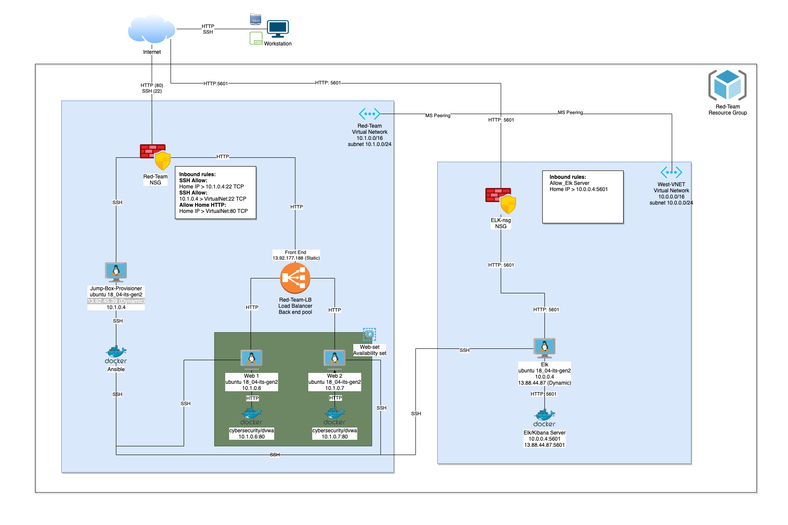
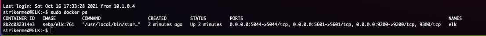
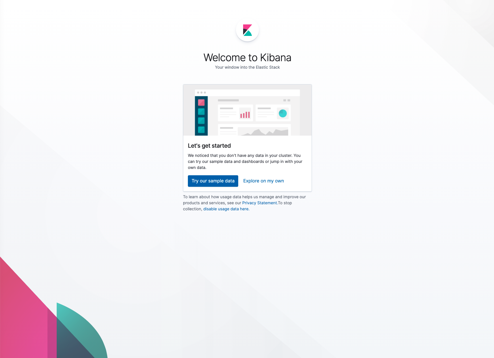
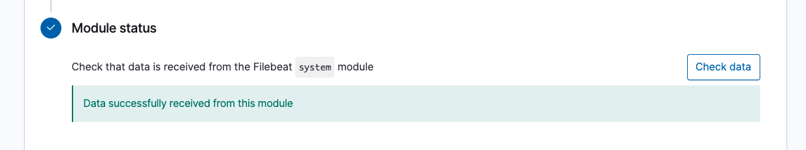
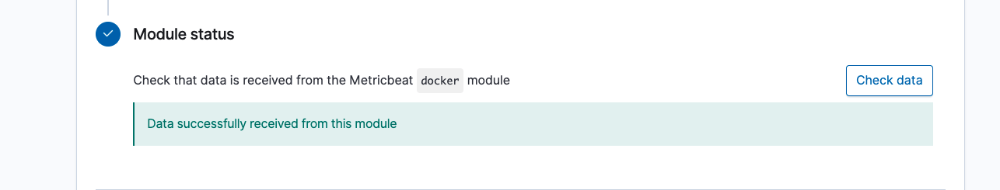

## Automated ELK Stack Deployment

The files in this repository were used to configure the network depicted below.



These files have been tested and used to generate a live ELK deployment on Azure. They can be used to either recreate the entire deployment pictured above. Alternatively, select portions of the [Ansible](https://github.com/strikermed/cybersecurity-Project-1/tree/main/Ansible) file may be used to install only certain pieces of it, such as Filebeat.

  - [ansible.cfg](https://github.com/strikermed/cybersecurity-Project-1/blob/main/Ansible/ansible.cfg)
  - [hosts](https://github.com/strikermed/cybersecurity-Project-1/blob/main/Ansible/hosts)
  - [webservers_DVWA_playbook.yml](https://github.com/strikermed/cybersecurity-Project-1/blob/main/Ansible/webservers_DVWA_playbook.yml)
  - [elk_playbook](https://github.com/strikermed/cybersecurity-Project-1/blob/main/Ansible/elk_playbook.yml)
  - [elk_filebeat_playbook.yml](https://github.com/strikermed/cybersecurity-Project-1/blob/main/Ansible/elk_filebeat_playbook.yml)
  - [filebeat-config.yml](https://github.com/strikermed/cybersecurity-Project-1/blob/main/Ansible/filebeat-config.yml)
  - [metricbeat-config.yml](https://github.com/strikermed/cybersecurity-Project-1/blob/main/Ansible/metricbeat-config.yml)
  - [elk_metricbeat_playbook.yml](https://github.com/strikermed/cybersecurity-Project-1/blob/main/Ansible/elk_metricbeat_playbook.yml)

This document contains the following details:
- Description of the Topology
- Access Policies
- ELK Configuration
  - Beats in Use
  - Machines Being Monitored
- How to Use the Ansible Build


### Description of the Topology

The main purpose of this network is to expose a load-balanced and monitored instance of DVWA, the D*mn Vulnerable Web Application.

Load balancing ensures that the application will be highly availabe, in addition to restricting access to the network.
- Load balancers protect the A in the CIA triad, Availability.  They do this by balancing traffic between web servers to ensure that neither is overloaded with traffic like what you would see from a DDOS attack.
- Jump box implementations shrink your attack surface and through utilizing an ansible container create a multi layer security profile which is protected via seperate ssh keys. For Example: You can remotely SSH into the jumpbox with your own ssh key, but you cannot use that same key to access the web servers.  In addition, the jump box also cannot access the web servers, a seperate docker container (ansible) only has access to the web servers via its own ssh key.

Integrating an ELK server allows users to easily monitor the vulnerable VMs for changes to the system logs and metrics.
- Filbeat monitors for changes to files, like the systemlog, and forwards that log data to either Elasticsearch or Logstash.
- Metricbeat collects information on the operating system and services running on the system it's installed on.

The configuration details of each machine may be found below.

| Name                 | Function       | Private IP Address | Public IP Address      | Operating System   | Docker Container |
|----------------------|----------------|--------------------|------------------------|--------------------|------------------|
| Jump-Box-Provisioner | Provisioner    | 10.1.0.4           | 13.92.45.39 (Dynamic)  | Linux Ubuntu 18_04 | Ansible          |
| Elk                  | Log Monitoring | 10.0.0.4           | 13.88.44.87 (Dynamic)  | Linux Ubuntu 18_04 | ELK/Kibana       |
| Web-1                | Web Server     | 10.1.0.6           | 13.92.177.188 (Static) | Linux Ubuntu 18_04 | DVWA             |
| Web-2                | Web Server     | 10.1.0.7           | 13.92.177.188 (Static) | Linux Ubuntu 18_04 | DVWA             |

### Access Policies

The machines on the internal network are not exposed to the public Internet. 

Only the Jump-Box-Provisioner machine can accept connections from the Internet. Access to this machine is only allowed from the following IP addresses:
- Home IP Address (Not provided for security reasons)

Machines within the network can only be accessed by the Ansible Docker Container installed on the Jump-Box-Provisioner.
- The webservers are only accessible publicly via HTTP (port 80), and restricted to be accessible only by a designated IP address
- The ELK VM, Web-1, and Web-2 can only be accessed via SSH from the ansible Docker Container running on the Jump-Box-Provisioner
- The ELK server can only be accessed publicly via HTTP (port 5601), and is restricted to be accessible only by a designated IP address

A summary of the access policies in place can be found in the table below.  These rules are in addition to the standard implicit deny rules already in place.

| Name                                   | Port | Protocol | Source          | Destination    | NSG Group   |
|----------------------------------------|------|----------|-----------------|----------------|-------------|
| Allow_DesignatedIP_SSH_Jumpbox         | 22   | TCP      | (Designated IP) | 10.1.0.4       | Red-TeamNSG |
| Allow_Jumpbox_SSH_Net                  | 22   | TCP      | 10.1.0.4        | VirtualNetwork | Red-TeamNSG |
| Allow_DesignatedIP_HTTP_VirtualNetwork | 80   | TCP      | (Designated IP) | VirtualNetwork | Red-TeamNSG |
| Allow_DesignatedIP_ElkServer           | 5601 | TCP      | (Designated IP) | 10.0.0.4       | ELK-NSG     |

### Elk Configuration

Ansible was used to automate configuration of the ELK machine. No configuration was performed manually, which is advantageous because...
- You can configure and deploy at scale quickly and efficiently
- Reduces configuration mismatch and errors
- allows for configuration changes at mass

The playbook implements the following tasks:
- Install Docker.io_TODO: In 3-5 bullets, explain the steps of the ELK installation play. E.g., install Docker; download image; etc._
- Install Python3-pip
- Install pip docker module
- Run commands to increase virtual memory to 262144 in current status and upon restart
- Download and launch docker elk container sebp/elk:761 and enable on boot

The following screenshot displays the result of running `docker ps` after successfully configuring the ELK instance.



### Target Machines & Beats
This ELK server is configured to monitor the following machines:
- 10.1.0.6 - Web-1 DVWA
- 10.1.0.7 - Web-2 DVWA

We have installed the following Beats on these machines:
- Filebeat
- Metricbeat

These Beats allow us to collect the following information from each machine:
- Filebeat collects system log data from each of the web VM's.  Data like events created by sudo command, useradd, groupadd, syslog information, and authentication logs like ssh login attempts, time stamps, and geo location information.
- Metricbeat collects system information and resource usage.  Information like CPU usage, Disk I/O usage, memory consumption, network traffic, and even health monitoring is all collected and sent to the ELK server.

### Using the Playbook
In order to use these playbooks you will need to either have the exact same network configuration, or modify the ansible.cfg, filebeat-config.yml, and metricbeat-config.yml to match your config. In addition you will need to have an Ansible control node already configured. Assuming you have such a control node provisioned: 

SSH into the control node and follow the steps below:
- Copy the elk_playbook.yml, elk_filebeat_playbook.yml, and elk_metricbeat_playbook.yml file to "/etc/ansible"
```
cd /etc/ansible && curl -O https://github.com/strikermed/cybersecurity-Project-1/blob/main/Ansible/elk_playbook.yml -O https://github.com/strikermed/cybersecurity-Project-1/blob/main/Ansible/elk_filebeat_playbook.yml -O https://github.com/strikermed/cybersecurity-Project-1/blob/main/Ansible/elk_metricbeat_playbook.yml
```
- Copy the filebeat-config.yml and metricbeat-config.yml to "/etc/ansible/roles"
```
cd /etc/ansible && mkdir roles && cd /etc/ansible/roles && curl -O https://github.com/strikermed/cybersecurity-Project-1/blob/main/Ansible/filebeat-config.yml -O metricbeat-config.yml
```
- Update the "hosts" file (Located /etc/ansible).  Locate "[webservers]" and include the IP addresses of your webservers.  Next and add a group labeled "[ELK]" and add the IP address for this server
```
cd /etc/ansible && nano hosts
```
- Update the ansible.cfg, look for "remote_user =" and insert the username with elevated privileges.  
```
cd /etc/ansible && nano ansible.cfg
```
- Run the playbook: webservers_DVWA_playbook.yml and navigate to http://13.92.177.188/setup.php (use your specified public IP) to check that the installation worked as expected.
```
ansible-playbook webservers_DVWA_playbook.yml
```
- Run the playbook: elk_playbook.yml and navigate to http://104.42.50.35:5601/app/kibana (use your specified public IP) to check that the installation worked as expected
```
ansible-playbook elk_playbook.yml
```
You should see something something like this:


- Run the Playbook: elk_filebeat_playbook.yml, then navigate to http://104.42.50.35:5601/app/kibana#/home/tutorial/systemLogs (use your specified public IP), and select "Check data" at the bottom of the page to confirm the installation worked as expected
```
ansible-playbook elk_filebeat_playbook.yml
```
You see something like this:


- Run the Playbook: elk_metricbeat_playbook.yml, then navigate to http://104.42.50.35:5601/app/kibana#/home/tutorial/dockerMetrics (use your specified public IP), and select "Check data" at the bottom of the page to confirm the installation worked as expected
```
ansible-playbook elk_metricbeat_playbook.yml
```
You should see something like this:

This should now allow you to monitor your 2 DVWA web servers via Kibana.
Happy Logging!